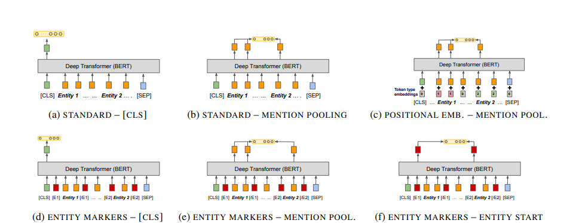
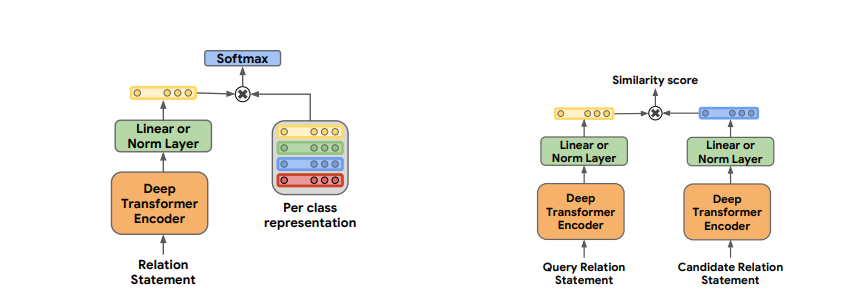

# PARSBERT-RE
#### Relation Extraction in the Persian language using transformers

Collaborators: [Nima Afshar](https://github.com/nimaafshar/) & [Nika Shahabi](https://github.com/nikashahabi)

This projection is an adaptation of the paper "Matching the Blanks: Distributional Similarity for Relation Learning" [^MTB] by Baldini et al. for the Persian language.

  

This project has two phases. First, we analyze different architectures for relation representation as the output of a deep transformer model. Second, we try a semi-supervised approach for relation classification as a distance-learning problem. PERLEX [^perlex] dataset has been used for the relation classification task. It is an expert-translated version of SemEval-2010 Task 8 [^semeval] to Persian.

  

## Relation Representations from Deep Transformers Model

<small>from [^MTB]</small>

We have tested six architectures proposed in the paper on our dataset. Their visualizations are available in the figure below. Architecture's names are in the form of "I-O", Where "I" is the entity span identification method which is applied on input tokens, and "O" is the Fixed length relation representation method done to the output of the transformer model to get the relation representation.

  

**Entity span identification methods:**

-   **Standard Input**: keep the default input tokens of the BERT model.
-   **Positional Embedding:** The positional embedding number for all the tokens in the first entity, all the tokens in the second entity, and all the tokens in the third entity are set to one, two, and zero, respectively.
-   **Entity Marker tokens:** Two special tokens named [E1] and [/E1] are added before and after the first entity tokens. In the same way, special tokens [E2] and [/E2] are added before and after the second entity tokens.

**Fixed length relation representation methods:**

-   **[CLS]:** In this method, the embedding for the special token [CLS] is used as the relation embedding.
-   **Entity mention pooling:** In this method, max-pooling is applied to the embeddings of all tokens in each entity to get the entity embedding. The relation representation is defined as the concatenation of the first and second entity embeddings.
-   **Entity start state:** The relation between two entities is represented by concatenating the final hidden states corresponding to their respective start tokens. Since this method can only be applied when the entity Marker tokens method is used as the entity span identification method, start tokens are [E1] and [E2].

  

## Matching the blanks

<small>from [^MTB]</small>

The paper suggests an assumption. This assumption is that for two equal pairs of entities placed in two different sentences, the structures of these two sentences probably imply similar relations. Therefore, these entities can be replaced with BLANK tokens in two sentences. These sentences can be fed to a model that returns a distance value. This value represents the similarity between the relation in the first sentence and the relation in the second sentence.

-   This method is not implemented yet.

[^MTB]: :page_facing_up: [Matching the Blanks: Distributional Similarity for Relation Learning](https://arxiv.org/abs/1906.03158)
  

[^perlex]: :page_facing_up: [PERLEX: A Bilingual Persian-English Gold Dataset for Relation Extraction](https://arxiv.org/abs/2005.06588)

  

[^semeval]: :page_facing_up: [SemEval-2010 Task 8: Multi-Way Classification of Semantic Relations Between Pairs of Nominals](https://arxiv.org/abs/1911.10422)
